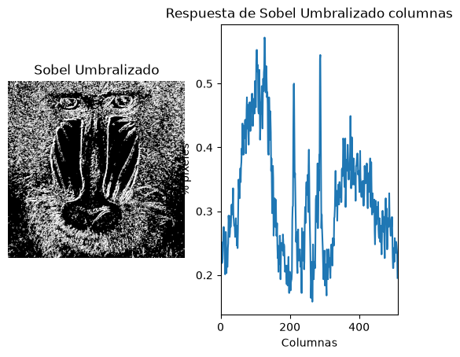
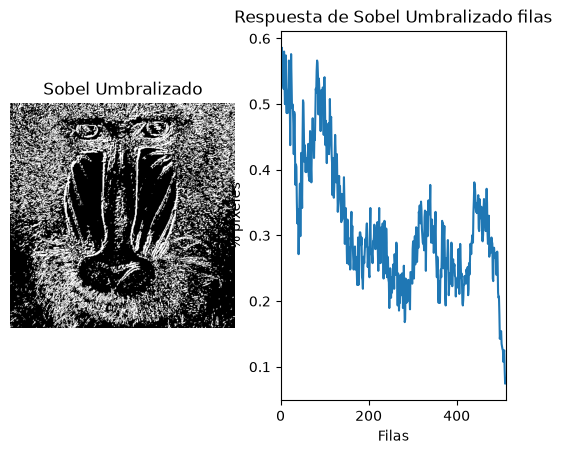
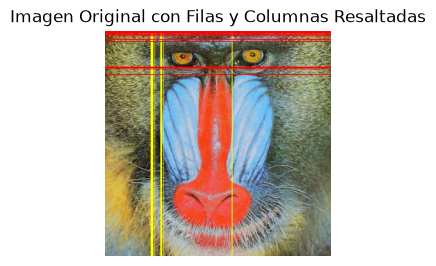

# Práctica 2: Funciones básicas de OpenCV - Visión por Computador

Repositorio de la Práctica 2 de la asignatura Visión por Computador (ULPGC). El proyecto, desarrollado mediante el cuaderno interactivo `VC_P2.ipynb`, aplica análisis espacial de contornos, procesamiento de gradientes (Canny y Sobel) y un demostrador interactivo en tiempo real.

## Estructura y Requisitos

El entorno de desarrollo requiere Python y las siguientes dependencias estándar: `opencv-python`, `numpy`, `matplotlib` y `Pillow`. Para asegurar el correcto funcionamiento del cuaderno, es necesario instalarlas previamente ejecutando los siguientes comandos en la terminal:

```bash
pip install opencv-python
pip install matplotlib
pip install numpy
pip install Pillow

```

El proyecto se organiza de la siguiente manera:

* **`VC_P2.ipynb`**: Cuaderno principal que contiene el código fuente, la ejecución por bloques y la justificación de las decisiones técnicas.
* **`assets/`**: Directorio destinado a almacenar las capturas de pantalla y demostraciones visuales de los resultados generados.

## Desarrollo de las Tareas y Demostrador

El cuaderno respeta la progresión del guion oficial para dar cumplimiento a las tareas exigidas, incorporando un demostrador interactivo propio:

* **Tarea 1 - Cuenta de píxeles blancos por filas en Canny:** Conteo de píxeles no nulos por filas sobre la imagen procesada por Canny, determinación del valor máximo (`maxfil`) y resaltado mediante primitivas gráficas de las filas que superan o igualan el 0.90 del máximo.

  El nucleo del código realiza un bucle recorriendo en este caso las filas. 
  ```python
  filas_posiciones = []
  for i in range(rows_counts.shape[0]):
    # Resalta las filas que superan el 90% del valor máximo de píxeles blancos
    if (maximo * 0.9 <= rows_counts[i][0]):
        filas_posiciones.append(i)  # Guardar la posición de la fila resaltada
        cv2.line(canny_resaltado, (0, i), (canny.shape[1]-1, i), (255, 0, 0), 1)  # Dibuja línea azul en la fila resaltada

    rows[i][0] = (rows_counts[i][0] / (255 * canny.shape[1]))
  ```

  


* **Tarea 2  - Gradiente de Sobel y Conteo Bidireccional:** Aplicación de umbralizado a la imagen resultante de Sobel (convertida a 8 bits), conteo por filas y columnas, cálculo de los valores máximos y marcado de las líneas que superan el 0.90 del máximo sobre la imagen del mandril, comparando los resultados frente a Canny.

  Bucle en filas que guarda las pocisiones y pinta linea en la imagen final.
  ```python
    for i in range(col_counts.shape[1]):
      # Resalta las filas que superan el 90% del valor máximo de píxeles blancos
      if (maximo_col * 0.9 <= col_counts[0][i]):
          filas_posiciones_col.append(i)  # Guardar la posición de la fila resaltada
          cv2.line(img, (i, 0), (i, sobel8Umbralizada.shape[0]-1), (255, 255, 0), 1)  # Dibuja línea amarilla en la fila resaltada
  ```
  


  Bucle en columnas que guarda las pocisiones y pinta linea en la imagen final.
  ```python
  for i in range(rows_counts.shape[0]):
    # Resalta las filas que superan el 90% del valor máximo de píxeles blancos
    if (maximo_row * 0.9 <= rows_counts[i][0]):
        filas_posiciones_row.append(i)  # Guardar la posición de la fila resaltada
        cv2.line(img, (0, i), (sobel8Umbralizada.shape[1]-1, i), (255, 0, 0), 1)  # Dibuja línea en la fila resaltada

    rows[i][0] = (rows_counts[i][0] / (255 * sobel8Umbralizada.shape[1]))
  ```

  

  


* **Tarea 3 - Demostrador Propio - Reinterpretación de "My Little Piece of Privacy":** Sistema interactivo en tiempo real basado en sustracción de fotogramas (`cv2.absdiff`) y umbralizado. Al detectar movimiento, genera dinámicamente un bloque de censura opaco.
  ```python
  # Búsqueda de contornos externos
  contornos, _ = cv2.findContours(umbral, cv2.RETR_EXTERNAL, cv2.CHAIN_APPROX_SIMPLE)
  
  # Preparación del lienzo en Pillow (RGB) para el renderizado del texto
  frame_rgb = cv2.cvtColor(frame, cv2.COLOR_BGR2RGB)
  img_pil = Image.fromarray(frame_rgb)
  draw = ImageDraw.Draw(img_pil)
  

  if contornos:
      # Identificar el contorno de mayor tamaño
      contorno_max = max(contornos, key=cv2.contourArea)
      
      # Ignorar movimientos minúsculos para evitar parpadeos por ruido
      if cv2.contourArea(contorno_max) > 1500: 
          # Extraer las coordenadas del rectángulo delimitador (bounding box)
          (x, y, w, h) = cv2.boundingRect(contorno_max)
          
          # Renderizado del bloque de privacidad
          draw.rectangle(((x, y), (x + w, y + h)), fill="black")
  ```

  * **Ampliación 1 - Demostrador Cara de gato:**  Sistema interactivo en tiempo real basado en sustracción de fotogramas (`cv2.absdiff`) y umbralizado. Al detectar movimiento, genera la cara de un gato conseguida dibujando formas geométricas.
 
  ```python
  # Búsqueda de contornos externos
  contornos, _ = cv2.findContours(umbral, cv2.RETR_EXTERNAL, cv2.CHAIN_APPROX_SIMPLE)
  
  # Preparación del lienzo en Pillow (RGB) para el renderizado del texto
  frame_rgb = cv2.cvtColor(frame, cv2.COLOR_BGR2RGB)
  img_pil = Image.fromarray(frame_rgb)
  draw = ImageDraw.Draw(img_pil)
  

  if contornos:
      # Identificar el contorno de mayor tamaño
      contorno_max = max(contornos, key=cv2.contourArea)
      
      # Ignorar movimientos minúsculos para evitar parpadeos por ruido
      if cv2.contourArea(contorno_max) > 1500: 
          # Extraer las coordenadas del rectángulo delimitador (bounding box)
          (x, y, w, h) = cv2.boundingRect(contorno_max)
          
          # Renderizado del bloque de privacidad
          # Dibujamos una cara de payaso cuando se mueve algo en la cámara
          draw.circle((x , y), h+100, fill="brown")  # Dibuja un círculo blanco como fondo
          draw.circle((x + w//2, y + h - 200), min(w, h)//4, fill="black")  # Dibuja un circulo azul como ojo arriba de la nariz
          draw.circle((x - w//2, y + h - 200), min(w, h)//4, fill="black")  # Dibuja un circulo azul como ojo arriba de la nariz
          draw.polygon([(x - w//2, y + h - 100), (x + w//2, y + h - 100), (x, y + h)], fill="orange")  # Dibuja un triángulo rojo como nariz
          draw.arc([(x - w//2, y + h - 50), (x + w//2, y + h + 50)], start=0, end=180, fill="black", width=6)  # Dibuja un arco rojo como sonrisa
          draw.line([(x - w//2, y + h - 70), (x - w, y + h - 100)], fill="black", width=3)  # Bigote izquierdo
          draw.line([(x + w//2, y + h - 70), (x + w, y + h - 100)], fill="black", width=3)  # Bigote derecho
          draw.line([(x - w//2, y + h - 50), (x - w, y + h - 50)], fill="black", width=3)  # Bigote izquierdo
          draw.line([(x + w//2, y + h - 50), (x + w, y + h - 50)], fill="black", width=3)  # Bigote derecho
          draw.line([(x - w//2, y + h - 25), (x - w, y + h)], fill="black", width=3)  # Bigote izquierdo
          draw.line([(x + w//2, y + h - 25), (x + w, y + h)], fill="black", width=3)  # Bigote derecho
  ```

  

  * **Ampliación 2 - Demostrador Detector de movimiento** Sistema interactivo en tiempo real basado en sustracción de fotogramas (`cv2.absdiff`) y umbralizado. Este sistema genera un pitido si el movimiento capturado supera un cierto rango.

  

  ```python
  # Diferencia entre fotogramas y binarización
  resta = cv2.absdiff(gris_ant, gris)
  _, mascara = cv2.threshold(resta, 30, 255, cv2.THRESH_BINARY)

  # Conteo directo de píxeles blancos en movimiento
  pixeles_mov = cv2.countNonZero(mascara)
  alerta = pixeles_mov > UMBRAL_PIXELES
  
  if alerta:
      if espera_sonido == 0:
          winsound.PlaySound("assets/alerta.wav", winsound.SND_FILENAME | winsound.SND_ASYNC)
          espera_sonido = 30  # Cooldown de fotogramas

    # Marco rojo exterior de aviso
    cv2.rectangle(frame, (0, 0), (frame.shape[1] - 1, frame.shape[0] - 1), (0, 0, 255), 8)
  ```


## Instrucciones de Uso

Para evaluar el proyecto correctamente y asegurar la estabilidad del entorno:

* Iniciar la sesión en Jupyter Notebook o entorno compatible y abrir el archivo `VC_P2.ipynb`.
* Ejecutar las celdas de forma secuencial para compilar las funciones en el orden establecido.
* En las celdas que invocan la captura de vídeo o la cámara web, es indispensable mantener el foco en la ventana emergente de OpenCV y presionar la tecla `ESC` para liberar el dispositivo de hardware y finalizar el proceso.

## Declaración de Uso de IA

Conforme a las directrices de la asignatura, se declara el uso de herramientas de Inteligencia Artificial bajo un rol estricto de consultoría técnica. Su aplicación se ha limitado a:

* La optimización del flujo de conversión de espacios de color entre las matrices de NumPy (OpenCV) y los objetos de dibujo de Pillow.
* La comprensión lógica del análisis estadístico de proyecciones horizontales y verticales sobre matrices de gradiente.
* El ajuste de los parámetros de contornos y supresión de ruido en la detección de movimiento por sustracción de fondo.

## Contribuidores
| Nombre | GitHub |
| :--- | ---: |
| Ricardo García Rodríguez | [Ricardo428](https://github.com/Ricardo428) |
| Juan Daniel López Melainine | [0nick3r](https://github.com/0nick3r) |
