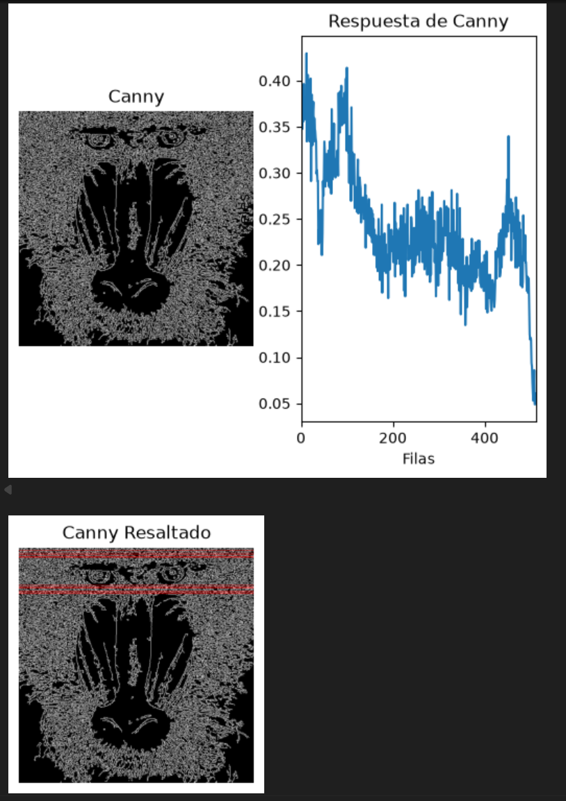

# Práctica 2: Funciones básicas de OpenCV - Visión por Computador

Repositorio de la Práctica 2 de la asignatura Visión por Computador (ULPGC). El proyecto, desarrollado mediante el cuaderno interactivo `VC_P2.ipynb`, aplica análisis espacial de contornos, procesamiento de gradientes (Canny y Sobel) y un demostrador interactivo en tiempo real.

## Estructura y Requisitos

El entorno de desarrollo requiere Python y las siguientes dependencias estándar: `opencv-python`, `numpy`, `matplotlib` y `Pillow`. Para asegurar el correcto funcionamiento del cuaderno, es necesario instalarlas previamente ejecutando los siguientes comandos en la terminal:

```bash
pip install opencv-python
pip install matplotlib
pip install numpy
pip install Pillow

```

El proyecto se organiza de la siguiente manera:

* **`VC_P2.ipynb`**: Cuaderno principal que contiene el código fuente, la ejecución por bloques y la justificación de las decisiones técnicas.
* **`assets/`**: Directorio destinado a almacenar las capturas de pantalla y demostraciones visuales de los resultados generados.

## Desarrollo de las Tareas y Demostrador

El cuaderno respeta la progresión del guion oficial para dar cumplimiento a las tareas exigidas, incorporando un demostrador interactivo propio:

* **Tarea - Cuenta de píxeles blancos por filas en Canny:** Conteo de píxeles no nulos por filas sobre la imagen procesada por Canny, determinación del valor máximo (`maxfil`) y resaltado mediante primitivas gráficas de las filas que superan o igualan el 0.90 del máximo.
  

* **Tarea - Gradiente de Sobel y Conteo Bidireccional:** Aplicación de umbralizado a la imagen resultante de Sobel (convertida a 8 bits), conteo por filas y columnas, cálculo de los valores máximos y marcado de las líneas que superan el 0.90 del máximo sobre la imagen del mandril, comparando los resultados frente a Canny.

* **Demostrador Propio - Reinterpretación de "My Little Piece of Privacy":** Sistema interactivo en tiempo real basado en sustracción de fotogramas (`cv2.absdiff`) y umbralizado. Al detectar movimiento, genera dinámicamente un bloque de censura opaco con la etiqueta tipográfica de alta calidad renderizada mediante Pillow (`PIL`).


## Instrucciones de Uso

Para evaluar el proyecto correctamente y asegurar la estabilidad del entorno:

* Iniciar la sesión en Jupyter Notebook o entorno compatible y abrir el archivo `VC_P2.ipynb`.
* Ejecutar las celdas de forma secuencial para compilar las funciones en el orden establecido.
* En las celdas que invocan la captura de vídeo o la cámara web, es indispensable mantener el foco en la ventana emergente de OpenCV y presionar la tecla `ESC` para liberar el dispositivo de hardware y finalizar el proceso.

## Declaración de Uso de IA

Conforme a las directrices de la asignatura, se declara el uso de herramientas de Inteligencia Artificial bajo un rol estricto de consultoría técnica. Su aplicación se ha limitado a:

* La optimización del flujo de conversión de espacios de color entre las matrices de NumPy (OpenCV) y los objetos de dibujo de Pillow.
* La comprensión lógica del análisis estadístico de proyecciones horizontales y verticales sobre matrices de gradiente.
* El ajuste de los parámetros de contornos y supresión de ruido en la detección de movimiento por sustracción de fondo.
